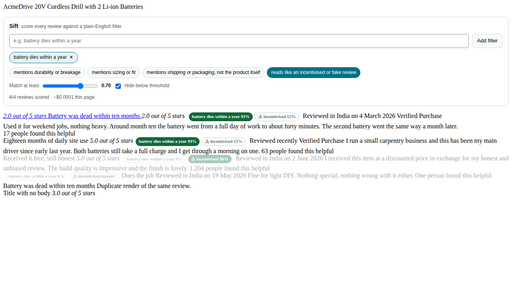
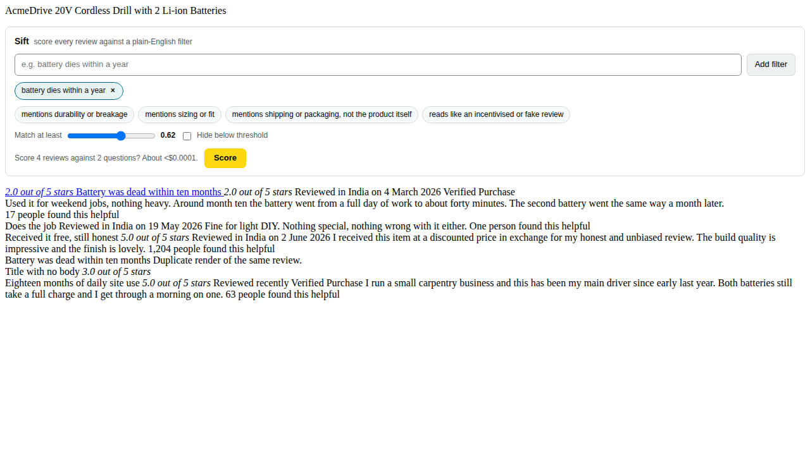
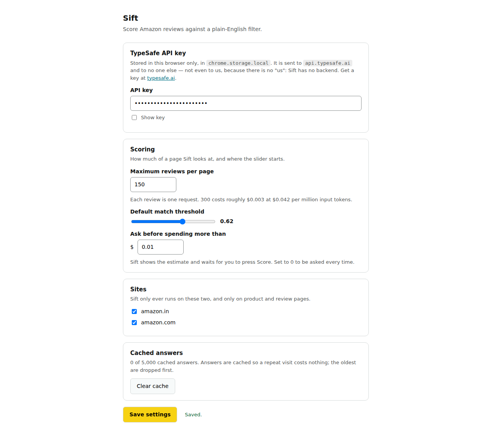

# Sift

A Chrome extension that scores every review on an Amazon product page against a
filter you type in plain English, then sorts the reviews by how well they match.

Type "battery dies within a year" and the reviews that actually say that rise to
the top, each tagged with a probability. Add a second filter, move the threshold,
dim everything below it.



## Status

Working end to end, but not yet verified against the live site. Read
[What has and has not been verified](#what-has-and-has-not-been-verified) before
you rely on it.

## How it works

Every review becomes one request to [TypeSafe](https://typesafe.ai)'s Jev model,
carrying every active filter as a separate question. Jev is a System One model: it
returns typed probabilities rather than generated text, in roughly 100ms, at $0.042
per million input tokens with output free. That is the only reason this works —
scoring 300 reviews per page, per user, costs about a third of a cent.

```
content script                 service worker              api.typesafe.ai
──────────────                 ──────────────              ───────────────
detect page  ─┐
scrape reviews│
panel UI      ├── message ──►  cache lookup
badges/sort  ─┘                (chrome.storage.local)
                               miss? ──────────────────►   POST /v1/systemone
                                                           one review per request,
                               ◄──────────────────────     all questions in parallel
              ◄── answers ──   store + summarise
```

The API key lives in the service worker and is never exposed to the page. Content
scripts ask the worker to score things; they never see the key.

Answers are cached under `sha256(reviewId + questionText)`, capped at 5,000 entries
with least-recently-used eviction. A repeat visit to the same product makes zero
requests. Changing the threshold or the sort never re-scores anything, because the
cached answers have not changed — only how they are displayed.

Reviews are sent in chunks of 50 rather than one message per page. Chrome evicts an
idle service worker after about 30 seconds, so one long message can outlive the
worker that is meant to answer it. Chunking keeps it awake, paints results as they
arrive, and makes an eviction cost one chunk. If a message finds no worker at all,
Sift retries once and then offers a **Resume** button rather than asking you to
reload.

Before a run that would cost more than you allow (default $0.01), the panel shows
what it is about to do — "Score 300 reviews against 11 questions? About $0.0043." —
and waits. Doing nothing is the cancel.



There is also a hard ceiling per page (default $0.05), checked before each chunk
rather than after, so it stops *before* crossing rather than reporting that it
did. When it stops it says what was spent and offers Continue.

The reviews you are looking at are scored first: on-screen, then just below the
fold, then what has scrolled past. That ordering is what makes the ceiling
tolerable — a run that stops half way has spent the money on the reviews you were
actually reading. It is recomputed each time, so resuming after a scroll picks up
where you now are.

## Filters

**Your own.** Type anything. It becomes one yes/no question pointed at the review's
title and body. Up to five at once.

**Presets**, as toggleable chips:

- mentions durability or breakage
- mentions sizing or fit
- mentions shipping or packaging, not the product itself
- reads like an incentivised or fake review

The last one is never asked as a single "is this fake?" question. It is three
separate signals — generic praise with no specifics, a disclosure of a free or
discounted product, and tone that does not match the star rating — combined in code
with weights you can edit in `src/questions/presets.ts`. An explicit disclosure
("I received this at a discount in exchange for my honest review") is close to
conclusive on its own, so it floors the combined score rather than being averaged
away.

It is also a flag, not a match: it badges a review but takes no part in ranking or
hiding. A review admitting it was incentivised is a warning about that review, not
a reason it answers what you searched for.

**Usefulness** is scored on every review against a three-level rubric (generic /
some specifics / concrete detail with usage context) and used as the secondary sort.

### About "unsure"

A yes/no answer from Jev carries no separate confidence value — the probability is
the whole answer. So when a probability lands near 0.5, meaning yes and no are about
equally likely, Sift shows a grey "unsure" badge instead of a number. Printing "51%"
there would imply a precision the model never claimed. The band is
`NOUL_UNSURE_BAND` in `src/questions/combine.ts`; widen or narrow it as you like.

Scores and choices do report confidence, so the usefulness rubric uses the real
value.

## Install

There is no Chrome Web Store listing yet. Load it unpacked:

```sh
git clone https://github.com/MEGA-M1ND/Sift.git
cd Sift
npm ci
npm run build
```

Then open `chrome://extensions`, turn on Developer mode, choose **Load unpacked**
and select the `dist/` folder.

The settings page opens on first install. Paste a TypeSafe API key and save.



## Settings

| Setting | Default | What it does |
| --- | --- | --- |
| API key | empty | Stored in `chrome.storage.local`. Without it, Sift shows one line in the panel and changes nothing else on the page. |
| Maximum reviews per page | 300 | Each review is one request. 300 is roughly $0.003. |
| Default match threshold | 0.70 | Where the panel's slider starts. |
| Ask before spending more than | $0.01 | Above this, the panel shows the estimate and waits for you to press Score. 0 asks every time. |
| Hard limit per page | $0.05 | Scoring stops before crossing this and offers Continue. 0 means no limit. |
| amazon.in / amazon.com | both on | Per-site switch. |
| Clear cache | — | Drops every cached answer. Next visit pays again. |

## Privacy

Review text goes to `api.typesafe.ai` and nowhere else.

No analytics. No telemetry. No remote config. No backend — there is no server
belonging to this project, so there is nothing for it to collect. The full text is
in [PRIVACY.md](PRIVACY.md).

## What has and has not been verified

Being straight about this, because a passing test suite can look like more than it is.

**Verified.** 231 unit tests and an end-to-end run that loads the built extension
into Chromium, serves a saved page at a real `amazon.in` URL so the manifest's match
patterns and page detection do their actual work, and checks that the panel mounts,
scores, badges, dims, reorders and then stops re-rendering. The retry and backoff
timings are measured, not mocked. CI runs all of it on every push.

**Not verified.** Two things, both because `amazon.in`, `amazon.com` and
`api.typesafe.ai` are all blocked by the network policy of the environment this was
built in:

1. **The selectors have never met a live Amazon page.** Every entry in
   `src/content/selectors.ts` is tagged `[corroborated]` (seen in a published
   scraper that parses live pages) or `[unverified]`. The fixtures in `fixtures/`
   are synthetic and say so. They test parser logic, not whether the selectors
   match today's markup. To find out, save a real page and run:

   ```sh
   npm run check-fixture -- path/to/saved-page.html
   ```

   Every field it reports as `MISS` is a selector to fix, and they are all in that
   one file.

2. **No request has ever reached Jev.** Calibration is unknown. Before trusting any
   probability, run the smoke script against the real API:

   ```sh
   npm run smoke
   ```

   It sends five hand-written reviews with three questions and prints the
   probabilities next to what each review was expected to score.

Pagination past the first page is also untested against the live site. Amazon often
redirects anonymous pagination to a sign-in page; Sift treats that as a normal
outcome, keeps the reviews already on the page, and says so in the console. Requests
are paced about a second apart so a full collection does not look like scraping, but
that has not been tested against Amazon either.

[docs/RISKS.md](docs/RISKS.md) ranks what is most likely to break first.

## When it stops working

Amazon changes its review markup often, so assume this will happen eventually.

Sift checks its own selectors on every page load and complains in the console
when they no longer fit. Open DevTools and look for a line starting `[Sift]`:

```
[Sift] Sift selector health: PROBLEMS FOUND
  ! 12 review cards were found, but none could be parsed. The body selector is
    the likeliest cause, since a card with no body text is dropped.

  list container   #cm_cr-review_list
  review card      [data-hook="review"]
  cards found      12
  reviews parsed   0 (12 dropped)
  ...
  body            0/12  MISS  <-- probably broken
```

It also catches the quieter failure: a field that broke without emptying the
page, such as ratings silently vanishing while everything else still works.

For the same report on demand, switch the console's context dropdown from `top`
to the Sift content script and run:

```js
__sift.report()   // selector health, as text
__sift.diagnose() // the same thing, structured
__sift.state()    // what Sift currently thinks about this page
```

Those live in the content script's isolated world, so nothing on the page can
see or call them.

To fix: save the page (Ctrl+S, or copy `document.documentElement.outerHTML`),
run `npm run check-fixture -- <file.html>`, and correct whatever it reports in
`src/content/selectors.ts`. That file is the entire blast radius.

## Development

```sh
npm test              # 231 unit tests, no network
npm run typecheck
npm run build         # produces dist/
npm run e2e           # loads dist/ into Chromium and drives the panel
npm run smoke         # five reviews against the real API (needs a key)
npm run check-fixture -- <file.html>
```

Put your key in a `.env` file (already gitignored) for `npm run smoke`. CI fails the
build if a key ever appears in a tracked file or anywhere in git history.

`docs/DECISIONS.md` has one line per non-obvious choice, with the reason.
`docs/RISKS.md` ranks the five things most likely to break first, with fixes.

### Layout

```
src/
  background/   service worker: API client, queue, cache
  content/      page detection, scraper, panel UI, DOM decoration
  questions/    presets.ts, buildQuestions.ts, combine.ts
  shared/       types, messaging, hashing, cost, settings
  options/      settings page
test/           vitest
fixtures/       saved review HTML for parser tests
```

`src/content/selectors.ts` holds every Amazon selector. Amazon changes its markup
often, and that file is the whole blast radius.

Each field lists several candidates, tried in order from most precise to most
general, and tagged `[corroborated]`, `[unverified]` or `[speculative]`. A
candidate that matches but yields nothing usable falls through to the next, so
adding a broad fallback cannot shadow a good one. Add to a list rather than
replacing an entry: one markup variant should not cost the other.

## Recording the 30-second demo

Record at 1280×800, Chrome zoomed to 100%, on a product with a few hundred reviews.

| Time | What to do | What should be on screen |
| --- | --- | --- |
| 0:00–0:03 | Land on an Amazon product page, already scrolled to the reviews. | Ordinary Amazon. The Sift panel sits above the reviews: "N reviews found. Add a filter to score them." |
| 0:03–0:08 | Type `battery dies within a year` into the filter box. Type it at a readable speed; do not paste. | The words appearing in the input. |
| 0:08–0:10 | Press Enter. | The chip appears, status changes to "Scoring N reviews…". |
| 0:10–0:15 | Do nothing. Let it finish. | Badges appearing on reviews, cards reordering, status settling to "N/N reviews scored · ~$0.00x this page". |
| 0:15–0:19 | Scroll down a little so a 93% review and a 6% review are both visible. | Green badge next to one star rating, grey next to another. |
| 0:19–0:23 | Click **Hide below threshold**. | Low scorers fade to 35% opacity. Nothing disappears. |
| 0:23–0:27 | Drag the threshold slider from 0.70 down to about 0.45. | More reviews un-dim, instantly. No "scoring" message — this costs nothing. |
| 0:27–0:30 | Click the **reads like an incentivised or fake review** chip. | A ⚠ badge appears on one or two reviews. The order does not change. |

The last beat is the one worth landing: the flag annotates, it does not re-rank.

Keep the browser console closed. Trim to exactly 30 seconds and export at 12–15fps;
the only motion is text and fades, so a low frame rate stays sharp and small.

## Not in this version

Flipkart, Google Maps, social feeds. Any text generation (Jev cannot, and no second
model is going anywhere near this). Summaries. Accounts. A backend. Firefox.

## Licence

MIT.
